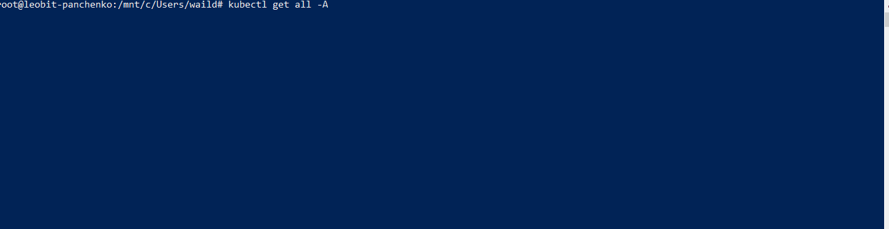

### Install k3d if non
https://k3d.io/v5.6.3/#install-current-latest-release

### Create a cluster
```bash
k3d cluster create argo
```

### Check cluster info
```bash
kubectl cluster-info
```


### Quick install Argo CD

```bash
kubectl create namespace argocd
```

```bash
kubectl apply -n argocd -f https://raw.githubusercontent.com/argoproj/argo-cd/stable/manifests/install.yaml
```

### Check components
```bash
kubectl get all -A
```


### Port forwarding
```bash
kubectl port-forward svc/argocd-server -n argocd 8080:443
```
### Get admin password
```bash
kubectl -n argocd get secret argocd-initial-admin-secret -o jsonpath={.data.password} | base64 -d; echo
```

### Login
    https://127.0.0.1:8080/
    login: admin
    pass: [from prew step]


    